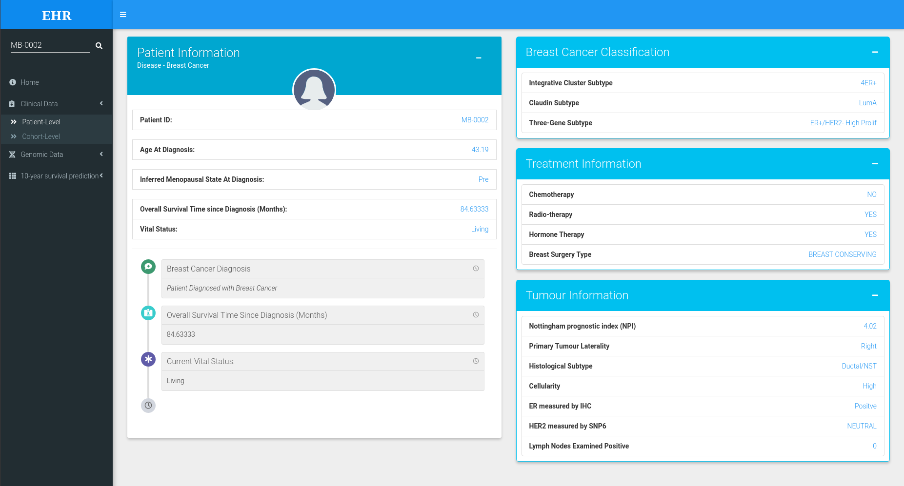
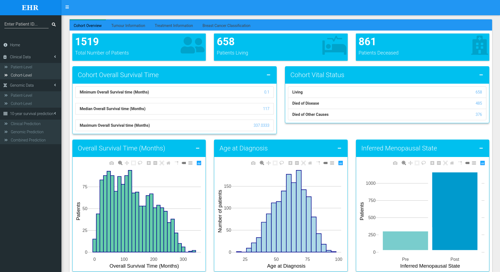

# EHR-METABRIC-Dashboard
This Shiny dashboard was developed using the METABRIC dataset, to enable analysis of patient data from EHRs with integration of genomic data to further advance combined clinical and molecular analysis of the data at both a patient-level and cohort-level.

METABRIC Data can be accessed through cBioPortal online at https://www.cbioportal.org/study/summary?id=brca_metabric

## This dashboard contains 4 main tabs:
**1. Home Tab:** Provides user with information about the app, contents of each tab and how to access the code

**2. Clinical Data Tab:** This tab has 2 sub-components: Patient-level and Cohort-level

- To query a specific patient, a valid patient ID number can be entered into the search-bar displayed at the top of the sidebar menu. This displays the
corresponding patient’s clinical data in the patient-level tab. This provides an overview of the recorded clinical data for the specified patient including
clinical variables such as age at diagnosis, tumour information, treatment received and breast cancer classification, allowing clinicians to easily access and interpret this data to make appropriate and efficient clinical decisions.

- Clinical data for the entire cohort is displayed in the cohort-level tab. The clinical data is displayed in a tabbed box with 4 tabs: Cohort overview, Tumour Information, Treatment Information and Breast Cancer Classification. Visualisations were generated using the plotly package which enables users to interact with the data (zoom in, hover over etc). Interactive data tables were generated using the DT package which allows users to search for a specific term in the data table and alter the number of rows displayed. Using these visualisations of the entire cohort clinical data, users can easily access and interpret the clinical data by interacting with the corresponding plots and tables.

**3. Genomic Data Tab:** This tab has 2 sub-components: Patient-level and Cohort-level

- For the individual patient (entered in the search bar), two interactive tables display the up-regulated and and down-regulated driver genes in the patient-level tab
- In the genomic data cohort-level tab, the results from the functional enrichment analysis of the 35 driver genes using gprofiler2 are displayed as an interactive plot. This visualisations provides an insight into the significantly enriched biological processes and pathways that the identified driver genes are involved in. Additionally, the results from the Cox PH model for identifying the driver genes significantly associated with breast cancer survival are displayed in an interactive data-table. Using the Cox PH model, 14 out of the 35 genes were identified to be significantly associated with breast cancer survival (p-values < 0.05). The results from the functional enrichment analysis of these 14 genes are displayed in a separate interactive plot. This provides users with a better understanding of the genomic information at a cohort-level.

**4. 10-year Survival Prediction Tab:** This tab has 3 sub-components: Clinical Prediction, Genomic Prediction and Combined Prediction.

- For each survival prediction RSF classifier model, users can select predictors to include using checkbox inputs. This enables clinicians to generate predictive models of ten-year breast cancer survival with their chosen predictors included. Upon selection of the predictors the user can press the “generate model” action button, which results in the construction of a RSF classifier model using the predictors selected by the user with an 80-20 training/test split of the dataset. The model information from the training set is displayed in an information box which includes the Out-of-bag (OOB) estimate of error rate and the confusion matrix. Furthermore, the variable importance for each predictor variable included in the model is displayed in an interactive table, to provide users with a better insight into the roles of each predictor variables in the resulting model. The ROC curve and AUROC for the model is displayed to allow clinicians to assess the performance of the resulting predictive model.
